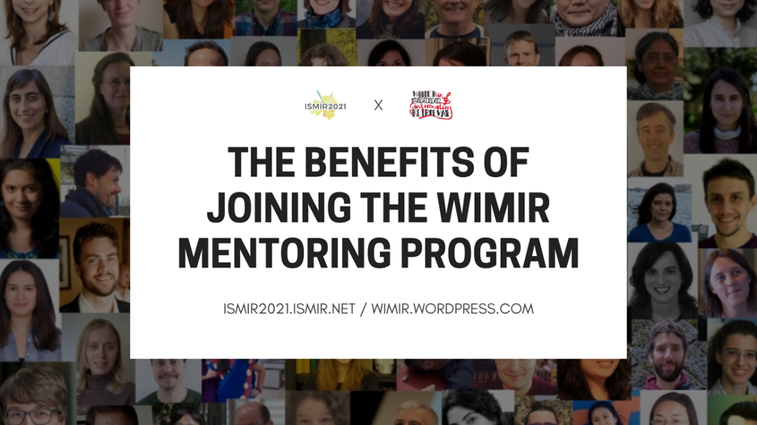

### Authors: Iris Yuping Ren, Magdalena Fuentes, Stefanie Acevedo, Qhansa Bayu, Blair Kaneshiro

_This blog post was originally published in [ISMIR 2021 conference](https://ismir2021.ismir.net/blog/benefits-wimir/) blog as a part of a series of posts aimed towards supporting Diversity &amp; Inclusion._

The [Women in Music Information Retrieval (WiMIR) mentoring program](https://wimir.wordpress.com/mentoring-program/) connects women students, postdocs, early-stage researchers, industry employees, and faculty to more senior women and men in MIR who are dedicated to increasing opportunities for women in the field. Mentors share their experiences and offer guidance to support mentees in achieving and exceeding their goals and aspirations. By connecting individuals of different backgrounds and expertise, this program strengthens networks within the MIR community, both in academia and industry.

The mentoring program has run annually since 2016: Participants typically sign up in the fall, are matched in January, and carry out four remote mentoring calls between January and June.

This blog post recounts some WiMIR mentees&#39; stories and experiences.

### &quot;WiMIR mentorship programme&quot; by Iris Yuping Ren, one of our mentees

_Originally published at_ [_https://wimir.wordpress.com_](https://wimir.wordpress.com/2016/06/20/wimir-mentorship-programme-by-iris-yuping-ren-one-of-our-mentees/) _on June 20, 2016 by Iris Yuping Ren._

Thanks to [Anja Volk](http://www.staff.science.uu.nl/~fleis102/) who invited me to write about my experience on the WIMIR mentorship programme. I&#39;m Iris Yuping Ren, a PhD student at the University of Rochester. I play the violin for fun and I studied mathematics and complex system science for my Bachelor and Masters. I&#39;m now working in the Audio Information Research (AIR) lab in the Electrical and Computer Engineering (ECE) department. You can find out more about me [here](https://sites.google.com/site/irisyupingren/).

I still remember that, when I was signing up for this programme, I was 80% excited and curious about:

- What is a mentorship programme? (since I&#39;ve never been in one)
- What kind of person will be my mentor?
- How will the programme help me?
- etc.

but also 20% uncertain about whether I should be involved

- Will there be extra workload for me?
- What if the conversations go wrong?
- etc.

Taking a weighted average of the pros and cons, I decided to join anyway! And now I&#39;m glad that I did that.

After filling in the sign-up sheet for the programme, I got an email about a few weeks later. I was assigned a mentor: Oriol Nieto, Scientist at Pandora. I was filled with joy: I like Pandora very much! I wanted to know more about the company, more about what research they do that made this guy choose the company and be chosen by them. Plus, the Committee was very considerate in the introduction email, providing a set of questions for us to talk about. I felt silly that I worried about the nothing-to-talk-about-first-time-Skyping embarrassment.

Oriol and I were then in contact, and had our first Skype a few days later. I was amazed by how the conversation was just flowing between us: from basic introduction to academical questions to considerations for the future. An hour of Skyping felt short! And that doesn&#39;t happen much.

Till now, Oriol and I have had 4 very nice sessions over Skype. Sometimes there are glitches from the internet connections (that&#39;s about all I can complain about), but every time I had such a great time chatting and learning with him. I could write the details of each Skype session, but I guess it won&#39;t offer much since they differ a lot from other mentors and mentees. But I think a more common thing is that I feel lots of support from a knowledgeable and experienced someone who works in the same field and cares about more things than just their work. I can&#39;t speak for everybody, but it was great for me to experience that!

### Transitioning from Master&#39;s to PhD: changing the scene from Uruguay to Paris

_Originally published at_ [_https://wimir.wordpress.com_](https://wimir.wordpress.com/2017/04/09/transitioning-from-masters-to-phd-changing-the-scene-from-uruguay-to-paris/) _on April 9, 2017 by Magdalena Fuentes._

Based on my experience, I think that the WiMIR mentoring program can make a difference in how young women join the MIR community. I was first introduced to the mentoring program by Martín Rocamora (Universidad de la República), my Master&#39;s advisor in Uruguay, the country in South America where I come from. In my country, there aren&#39;t many people working in MIR, and when I first joined the mentoring program I wasn&#39;t involved in the community yet. I found the idea of being in touch with experienced people from the MIR community who could talk to me about different scenarios very motivating.

During the same period that I had meetings with my mentor Ana Maria Barbancho (Universidad de Málaga, Spain), I did an internship on a MIR-related task in Paris. At that time, I was trying to decide what to do after, and all the exchanges with the people at the lab in Paris and my mentor were very enriching. The different points of view were valuable for getting an idea of what the MIR community was like and what I really wanted to do. Being in contact with my mentor was helpful because I could discuss things from another point of view, complementing the other opinions people offered. After my internship, I enrolled in a PhD program in France, and I&#39;m currently working in MIR at the labs L2S (CentraleSupélec) and LTCI (Télécom ParisTech).

The MIR mentoring program itself offers a wide and interesting context for discussion. The topics that were proposed for the meetings (life/work balance, academic career, etc) are issues that are relevant to our daily life but in my experience they are not commonly discussed as they should. So it was very nice to have the opportunity to talk about these topics with an experienced person who also has similar interests to mine. Furthermore, there is also room for technical discussions and exchanges, which is a great help for someone who is starting in the field and is generally full of doubts. I&#39;m currently taking part in the [second round of the program](https://wimir.wordpress.com/2017/01/20/mentoring-round-2017-is-about-to-start/) with a different mentor, Justin Salamon (New York University), and once again it has been a very enriching exchange for which I&#39;m very grateful.

Initiatives like the WiMIR mentoring program encourage diversity in the MIR community and stimulate young researchers to get more involved in the field. I think it&#39;s worth starting more enterprises like this, in particular those encouraging the participation of both male and female young researchers from places where the MIR community is not yet strongly present.

### Mentorship as a way to mind the gap in music academia and to prepare students for the &quot;real world.&quot;

_Originally published at_ [_https://wimir.wordpress.com_](https://wimir.wordpress.com/2017/05/16/mentorship-as-a-way-to-mind-the-gap-in-music-academia-and-to-prepare-students-for-the-real-world/) _on May 16, 2017 by Stefanie Acevedo._

I knew I wanted a career in music academia since I was fifteen. Now, as I begin the last year of my PhD program in music theory, I feel a mixture of fear, eagerness, and sometimes, uncertainty as to whether I wish to continue in the field. This comes not only due to increasing hostility toward the &quot;liberal conspiracy&quot; of higher education, budget cuts across the board for humanities and music programs, and increasing corporatization of Universities, but also due to slowed (and perhaps even declining) progress for women&#39;s and minority rights in the United States. After spending so many years in graduate school, I worry that all of that effort will be for naught and that my student debt will only grow deeper and deeper due to accruing interest while I make ends meet as an adjunct or visiting professor.

Then again, that anxiety may just be coming from my impostor syndrome [1].

Yet the reality brought on by many of these problems ring true, especially for individuals who make up minorities in musicology fields (women, people-of-color, people with disabilities, and LGBTQ individuals alike): not only must we navigate the world as minorities, but we are also facing a volatile job market.

As a rising educator, then, how can I speak to my students, especially those who are minorities, and tell them that music is a worthwhile career? How can I responsibly educate my students and let them know that, despite spending many years and dollars putting themselves through graduate school, they might have to face years of uncertainty on the job market?

This is where mentoring programs by organizations like WiMIR play a large role.

But first, let us ignore the current job market and focus on the benefits of mentoring. We know that mentoring and support systems allow minority students to thrive [2]. Many minority students are surrounded by societal pressures and, consequently, insecurity – a mentor, aware of the psychological and social dynamics at play, is then able to aid the student in reaching their goals. I, personally, have been lucky to have a PhD advisor who is sensitive to the hardships faced by minority students, and can thus, guide me in matters other than my dissertation research. I am also very lucky to have a wide support network of past professors and mentors who have encouraged me along the way. Many students, especially minorities, do not have that type of support from their advisors or professors, and could benefit from these type of relationships beyond their immediate school environments.

Further, research has shown that women and other minority faculty are more likely to take on mentoring roles than non-minority faculty [3]. This can be problematic in, at least, two ways: A) The amount of time spent on mentoring and related service can compromise minority faculty&#39;s research time (affecting advancement in their field) [4] and B) in departments were minority faculty are scarce, students may not be able to receive the full support they require (leading to lower diversity). Organizational mentoring programs, such as WiMIR&#39;s, can definitely provide outside help to attenuate these problems. These programs also have the potential to indirectly alter department cultures. By becoming mentors, non-minority faculty members can learn and adapt their mentoring to better suit the needs of minority students (and faculty) – they are often even more willing to mentor in the future [5]. Many benefits arise. First of all, minority faculty would be less burdened, giving them more time to research or extend their service elsewhere. If a wider range of faculty invested time into and valued mentoring and similar service more, those activities may be better appreciated by the University as a whole – the service may then be weighed more heavily on, for example, the tenure dossier [6]. And, finally, as non-minority faculty become better attuned to issues faced by minorities, they can facilitate change in department cultures toward inclusivity and diversity [7].

More importantly, though, mentoring programs by organizations such as WiMIR can aid students in diversifying their interests in order to better prepare them for successful careers. As an educator in music, I believe it is my duty to enable students to follow their dreams, but also to prepare them for the real world. As a Hispanic woman, I want to increase the diversity in music theory, but I feel a responsibility to my students to give them the broader picture: academia is cutthroat, the road is long, and job prospects are difficult. I want students to be able to follow their hearts and passion for the arts, but I also want them to have financially-stable and bright futures. The best possible way to prepare a student for a music career, in my opinion, is to diversify their portfolio with a secondary interest in order to develop lucrative skills (not just for a job at a music department, but also for a job in Arts Management at BMI or ASCAP, or as a Data Scientist at Spotify or Google). In my case, I diversified by pursuing a master&#39;s degree in experimental psychology and learning computational skills. We need to be marketable as specialists in music that can apply that knowledge outside of the concert hall or theory classroom. While Universities tout interdisciplinarity, resources are often lacking and students may not have the knowledge, time, or guidance to seek out secondary interests (especially at disadvantaged schools). Not many students can afford the luxury of getting multiple degrees. At many schools, a music degree does not provide training beyond the traditional Western Classical music curriculum. This, then, is where external mentorship can aid students to not only experiment and define other interests, but also gain exposure to and prepare themselves for alternate career paths that also utilize their musical talent. Even for older students, like myself, or those who have already graduated, cross-disciplinary mentorship can help us expand our horizons, leading to a broader portfolio, an increased awareness of the applications of our research, or even, a back up career plan.

[**Stefanie Acevedo**](https://stefanieacevedo.com/) _is a PhD Candidate in music theory at Yale University. She is a past member of the Society for Music Theory&#39;s_ [_Committee for the Status of Women_](https://womeninmusictheory.wordpress.com/)_, a past board member of the_ [_International Alliance for Women in Music_](https://iawm.org/)_, and currently serves as a member of the Graduate and Professional Student Title IX Advisory Board at Yale. Her dissertation is a computational and EEG study of popular harmony expectation. She is currently a mentee in WiMIR&#39;s mentorship program._

**END NOTES:**

1. Peteet, B.J., L. Montgomery, and J.C. Weekes (2015). &quot;Predictors of imposter phenomenon among talented ethnic minority undergraduate students.&quot; _The Journal of Negro Education_ 84(2), pp. 175-186; Richards, C. (2015). &quot;Learning to deal with the Impostor Syndrome.&quot; _The New York Times_, October 26.
2. Thomas, K.M., L.A. Willis, and J. Davis (2007). &quot;Mentoring minority graduate students: issues and strategies for institutions, faculty, and students.&quot; _Equal Opportunities International_ 26(3): pp.178-192, doi: 10.1108/02610150710735471; Blackwell, J.E. (1989). &quot;Mentoring: An action strategy for increasing minority faculty.&quot; _Academe_ 75(5), pp. 8-14.
3. Acker, S. and G. Feuerverger (1996). &quot;Doing good and feeling bad: The work of women university teachers.&quot; _Cambridge Journal of Education_ 26(3), pp. 401-422.; Flaherty, C. (2015). &quot;Negotiating Balance.&quot; _Inside Higher Education_, April 22.
4. Guarino, C.M., and M.H. Borden (2017). &quot;Faculty service loads and gender: Are women taking care of the academic family?&quot; _Research in Higher Education_.
5. Ragins, B.R. and J.L. Cotton (1993). &quot;Gender and willingness to mentor in organizations.&quot; _Journal of Management_ 19(1), pp. 97-111.
6. Aguirre, A., Jr. (2000). &quot;Women and minority Faculty in the Academic Workplace: Recruitment, Retention, and Academic Culture.&quot; _ASHE-ERIC HIgher Education Report_ 27(6).
7. Baez, B. (2000). &quot;Race-related service and faculty of color: Conceptualizing critical agency in academe.&quot; _Higher Education_ 39(3), pp. 363-391.

For more blog posts about the WiMIR mentoring program, click [here](https://wimir.wordpress.com/category/mentoring/)!

_**The 23rd International Society for Music Information Retrieval** (ISMIR) Conference Registration is now OPEN! Join the ISMIR2022 Tutorials, Conference, and Satellite Events by Registering at [**https://ismir2022.ismir.net/attend/registration**](https://ismir2022.ismir.net/attend/registration). We also have several grants to cover REGISTRATION and TUTORIAL fees, as well as CHILDCARE expenses. Apply here: [**https://ismir2022.ismir.net/attend/support**](https://ismir2022.ismir.net/attend/support)_

